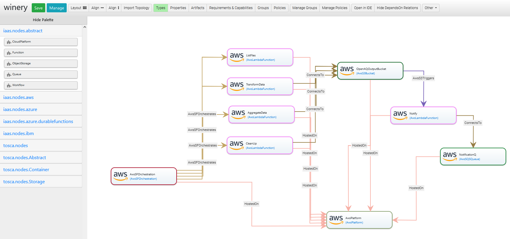

# Open Air Quality ETL Function Orchestration Blueprint for AWS
This project contains a deployable TOSCA model of a function orchestration combined with regular serverless components implemented for AWS services.
The details on the implementations are provided [in the case study description](../../../../etl-case-study/README.md).
The TOSCA model of the application created in Eclipse Winery is shown below:


## How to Deploy it
To deploy this TOSCA model, several requirements need to be fulfilled. 
Firstly, this model relies on the [xOpera TOSCA orchestrator](https://github.com/xlab-si/xopera-opera), since all deployment logic is implemented using Ansible. 
xOpera needs to be [installed](https://xlab-si.github.io/xopera-docs/opera_cli.html#installation) on the machine from which the deployment will be enacted, as well as the AWS credentials have to be configured, e.g., by running `aws configure`.
Note, that the used AWS credentials must have permissions to work with employed AWS services, i.e., AWS Lambda, AWS Step Functions, AWS S3, AWS SQS, and Amazon Event Bridge.

Install `opera`, `boto3`, and `botocore`:
```
pip install opera
pip install boto3
pip install botocore
```

Export the CSAR using Eclipse Winery and execute
```
opera deploy <csar root directory>
```
For more information, see Eclipse Winery's [documentation](https://winery.readthedocs.io/en/latest/user/getting-started.html).

## Additional Dependencies

To avoid packaging functions with dependencies, the deployment relies on the following AWS Lambda layers:
- arn:aws:lambda:eu-central-1:770693421928:layer:Klayers-python38-numpy:18
- arn:aws:lambda:eu-central-1:770693421928:layer:Klayers-python38-pandas:35

To update version of `pandas` or `numpy`, check lates ARNs for teh respective layers in the desired region [in this repository](https://github.com/keithrozario/Klayers/tree/master/deployments/python3.8/arns) and update the corresponding properties in the `ServiceTemplate.tosca`.


