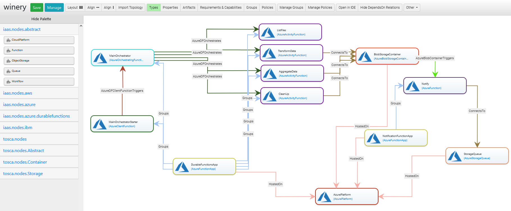

# Open Air Quality ETL Function Orchestration Blueprint for Azure
This project contains a deployable TOSCA model of a function orchestration combined with regular serverless components implemented for Azure services.
The details on the implementations are provided [in the case study description](../../../../etl-case-study/README.md).
The TOSCA model of the application created in Eclipse Winery is shown below:


## How to Deploy it
To deploy this TOSCA model, several requirements need to be fulfilled. 
Firstly, this model relies on the [xOpera TOSCA orchestrator](https://github.com/xlab-si/xopera-opera), since all deployment logic is implemented using Ansible. 
xOpera needs to be [installed](https://xlab-si.github.io/xopera-docs/opera_cli.html#installation) on the machine from which the deployment will be enacted.
The implemented deployment scripts require having `azure-cli` installed on the machine where xOpera is launched.
Further, the sign in is achieved [using a service principal](https://docs.microsoft.com/en-us/cli/azure/create-an-azure-service-principal-azure-cli#sign-in-using-a-service-principal), therefore the following environment variables need to be defined on the machine running xOpera, e.g., by using: 
```
export AZURE_SUBSCRIPTION_ID=MY-SUBSCRIPTION-ID
export AZURE_CLIENT_ID=MY-APP-ID
export AZURE_SECRET=MY-PASSWORD
export AZURE_TENANT=MY-TENANT-ID
```

Export the CSAR using Eclipse Winery and execute
```
opera deploy <csar root directory>
```
For more information, see Eclipse Winery's [documentation](https://winery.readthedocs.io/en/latest/user/getting-started.html).
